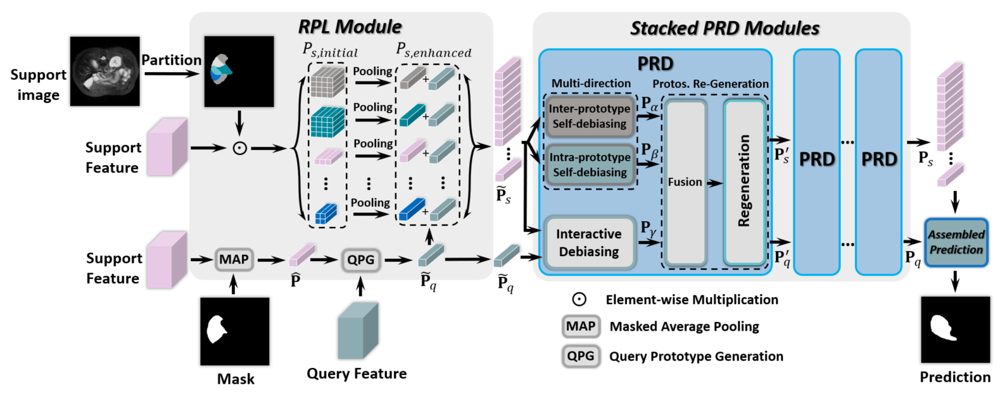

# Partition-A-Medical-Image: Extracting Multiple Representative Sub-Regions for Few-Shot Medical Image Segmentation
The Implementation of Paper: Partition-A-Medical-Image: Extracting Multiple Representative Sub-Regions for Few-Shot Medical Image Segmentation



#### Abstract
Few-shot Medical Image Segmentation (FSMIS) is a more promising solution for medical image segmentation tasks where high-quality annotations are naturally scarce. However, current mainstream methods primarily focus on extracting holistic representations from support images with large intra-class variations in appearance and background, and encounter difficulties in adapting to query images. In this work, we present an approach to extract multiple representative sub-regions from a given support medical image, enabling fine-grained selection over the generated image regions. Specifically, the foreground of the support image is decomposed into distinct regions, which are subsequently used to derive region-level representations via a designed Regional Prototypical Learning (RPL) module. We then introduce a novel Prototypical Representation Debiasing (PRD) module based on a two-way elimination mechanism which suppresses the disturbance of regional representations by a self-support, Multi-direction Self-debiasing (MS) block, and a support-query, Interactive Debiasing (ID) block. Finally, an Assembled Prediction (AP) module is devised to balance and integrate predictions of multiple prototypical representations learned using stacked PRD modules. Results obtained through extensive experiments on three publicly accessible medical imaging datasets demonstrate consistent improvements over the leading FSMIS methods.

# Getting started

### Dependencies
Please install following essential dependencies:
```
dcm2nii
json5==0.8.5
jupyter==1.0.0
nibabel==2.5.1
numpy==1.22.0
opencv-python==4.5.5.62
Pillow>=8.1.1
sacred==0.8.2
scikit-image==0.18.3
SimpleITK==1.2.3
torch==1.10.2
torchvision=0.11.2
tqdm==4.62.3
```

### Data sets and pre-processing
Download:
1) [Combined Healthy Abdominal Organ Segmentation data set](https://chaos.grand-challenge.org/)
2) [Multi-sequence Cardiac MRI Segmentation data set](https://zmiclab.github.io/projects/mscmrseg19/) (bSSFP fold)
3) [Multi-Atlas Abdomen Labeling Challenge](https://www.synapse.org/#!Synapse:syn3193805/wiki/218292)

Pre-processing is performed according to [Ouyang et al.](https://github.com/cheng-01037/Self-supervised-Fewshot-Medical-Image-Segmentation/tree/2f2a22b74890cb9ad5e56ac234ea02b9f1c7a535) and we follow the procedure on their github repository.

### Training
1. Compile `./supervoxels/felzenszwalb_3d_cy.pyx` with cython (`python ./supervoxels/setup.py build_ext --inplace`) and run `./supervoxels/generate_supervoxels.py` 
2. Download pre-trained ResNet-101 weights [vanilla version](https://download.pytorch.org/models/resnet101-63fe2227.pth) or [deeplabv3 version](https://download.pytorch.org/models/deeplabv3_resnet101_coco-586e9e4e.pth) and put your checkpoints folder, then replace the absolute path in the code `./models/encoder.py`.  
3. Run `./script/train.sh` 

### Inference
Run `./script/test.sh` 

### Acknowledgement
Our implementation is based on the works: [SSL-ALPNet](https://github.com/cheng-01037/Self-supervised-Fewshot-Medical-Image-Segmentation), [ADNet](https://github.com/sha168/ADNet) and [QNet](https://github.com/ZJLAB-AMMI/Q-Net)

